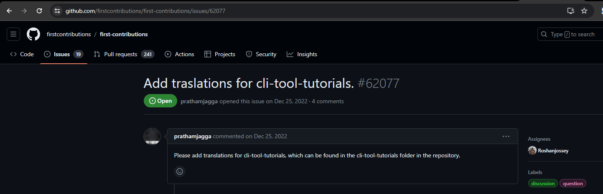

# PART 1 - OPEN SOURCE COMMUNITY CONTRIBUTION

## Contribution for First Contributions 

### Description
The [First Contributions](https://github.com/firstcontributions/first-contributions) initiative aims to simplify and make it easier for newcomers to contribute to open-source projects by streamlining and facilitating the procedure. Whether you're new to coding or looking for your first project contribution experience, this effort seeks to offer contributors a clear advice and help at every stage.

"First Contributions" takes a user-friendly approach, providing simple steps that lead beginners through the process of making their first contribution easy. The project makes complicated procedures easier to understand and guarantees that newcomers have the confidence to engage with the open-source community with features like forking repositories and pull request submission.

The project is noteworthy for its enormous translation effort, since the README.md has been translated into 76 different languages. Through the use of many languages, the project is made more inclusive and accessible, allowing people from a variety of linguistic backgrounds to participate and contribute for the first time.

### My Fork of the First Contributions Project

Explore my forked version of the Cli-Tool-Tutorial Sinhala translation [here](https://github.com/nazrinzuwair/first-contributions/tree/cli-tool-tutorial-sinhala-translation). I've taken the initiative to translate the content into Sinhala, aiming to make it more accessible to a broader audience.

### Summary of the Identified Issue:

The issue I examined was [issue 62077](https://github.com/firstcontributions/first-contributions/issues/62077), which involves adding translations for the cli-tool-tutorials. While the README.md file has been translated into 76 languages, the cli-tool-tutorials, serving as a crucial guide for first-time contributors navigating the terminal, currently lacks translations in languages beyond Spanish, Hindi, Urdu, and French. Despite the issue being opened on December 25, 2022, with its last commit made on July 25, 2023, there has been limited active contribution from contributors in making translations available.

### Approach To Solving The Issue

To address this issue, I will focus on the language used by Sri Lankans, which is Sinhala. The reason for choosing this language is that it is my native language, and I am proficient in it. The steps that I will follow in addressing the issue are as follows:

   1. First, I will carefully review the content of the cli-tool-tutorials, ensuring a thorough understanding of the intended message.
   2. Next, I will proceed to translate the content into Sinhala.
   3. Finally, I will meticulously proofread the text to eliminate any grammatical errors and ensure clarity and accuracy.

### Summary Of Peer Code Review

The translation of the GitHub CLI tutorial underwent a thorough review by [Tharnindu Mudduwe Jayasekara](https://github.com/tharinduj31). Here's a summary of the feedback provided:

1. Grammar and Clarity Improvement:
   - Some letters in Sinhala were noted to overlap with English words, potentially causing confusion. Tharnindu suggested that if fixing these overlaps in Sinhala proves difficult, it might be better to stick with the English term. For instance, he highlighted the phrase "Terminal nerds" as an example.

2. Specific Revisions:
  - Requested changes to the following terms:
      -  Line 18: Changed `කිසිදු චිත්‍රක` to `*කිසිදු විටෙක`.
      -  Line 18: Changed `අභියෝගාත්මක ය` to `අභියෝගාත්මකය`.
      -  Line 95: Modified the heading from `## මෙතනින් කොහෙට යන්නද?` to `*කොහෙටද යන්නෙ?`.
      -  Line 105: Updated the heading from `### [අතිරේක ද්‍රව්‍ය]` to `*අතිරේක මූලාශ්‍ර`.

The result of the code review can be found [here](https://github.com/firstcontributions/first-contributions/pull/82798).

### Reflection on Success

The translation process presented considerable challenges, particularly when encountering technical terms that were complex to render accurately in Sinhala. As a result, I made the decision to maintain certain terms in their original English form. This choice stemmed from the realization that readers are often more familiar with these terms in English, given their prevalence within GitHub's interface and documentation. Retaining these terms in English helps ensure better comprehension of the content and its associated processes.

Despite these challenges, the review conducted by Tharindu proved immensely valuable in navigating these obstacles. His insights and suggestions provided guidance on how to address the linguistic nuances and maintain clarity in the translated text. One notable suggestion was to retain English words that overlapped with Sinhala equivalents, thereby enhancing clarity and ensuring the intended message was conveyed effectively to the user.

In conclusion, while the translation process presented hurdles, collaboration with Tharindu and the acceptance of his feedback facilitated overcoming these challenges. This collaborative effort ultimately led to an improved translation that effectively serves its purpose in conveying information to the target audience.

## Discussion of next steps

The next step involves proofreading the translated document thoroughly. This ensures that any remaining errors or inconsistencies are identified and corrected, guaranteeing the final translation is polished and accurate. Additionally, seeking feedback from peers or reviewers can provide valuable insights to further refine the document. Once the proofreading process is complete, the final version can be confidently shared with the target audience, contributing to the success and impact of the project.

## Reference
First Contribution   s. (n.d.). first-contributions. Retrieved from https://github.com/firstcontributions/first-contributions

# PART 2 - CONTRIBUTION TO DGL 104 PATTERN LIBRARY REPOSITORY

## List of Contributions

**Contributions by Myself:**
- [Identifying Potential Additional Design Patterns #26](https://github.com/nic-dgl104-winter-2024/pattern-library/issues/26)
- [Proposing a New Filename Scheme for All Pattern Files #45](https://github.com/nic-dgl104-winter-2024/pattern-library/issues/45)
- [Researching a Preferred Licensing Scheme for This Repository #19](https://github.com/nic-dgl104-winter-2024/pattern-library/issues/19)

**Code Reviews:**
- [Review on John's Abstract Factory and Design Patterns Folder Structure](https://github.com/nic-dgl104-winter-2024/pattern-library/pull/50)
- [Review on Katrina's Add JS Observer Pattern #3 #53](https://github.com/nic-dgl104-winter-2024/pattern-library/pull/53)

**Documentation Contribution:**
- [Review on Sumit's Contribution to Dev FP vs OOP #73](https://github.com/nic-dgl104-winter-2024/pattern-library/pull/73)

## Reflection on Success
In this task, my main focus was on examining issues related to my chosen programming language, which was JavaScript. Apart from code contributions, I also participated in code review, documentation, and research activities. Regarding code contributions, my focus was mainly on design patterns, specifically the Facade design pattern and Abstract Factory design pattern. I provided detailed overviews of each design system in separate files and included code snippets to elaborate on them. As for code review, I reviewed repositories belonging to Sumit, John, and Katrina, and commented on identified issues, requesting amendments. I then re-reviewed the code after their amendments, simultaneously, until the issues were resolved. Additionally, I conducted research to identify the best license for the pattern-library repository. Overall, contributing to Part 2 of the project helped me improve my knowledge and skills, as well as enhance teamwork abilities.

## References

GarrettMac. (2017, September 14). Javascript’s 3 Major Paradigms: Introduction [part 1 of 4]. Retrieved from Medium: https://medium.com/@garrettmac/javascripts-3-major-paradigms-55b5e3b18b8c

Geeks for Geeks. (2023, May 24). Introduction to Object Oriented Programming in JavaScript. Retrieved from Geeks for Geeks: https://www.geeksforgeeks.org/introduction-object-oriented-programming-javascript/

Maria, M. (2023, December 20). Programming Paradigms in JavaScript. Retrieved from https://dev.to/marmariadev/programming-paradigms-in-javascript-oop-functional-and-event-driven-57kn

Yusuf, A.-a. (2020, October 25). Paradigms In JavaScript. Retrieved from Dev: https://dev.to/alamin__yusuf/paradigms-in-javascript-1m31