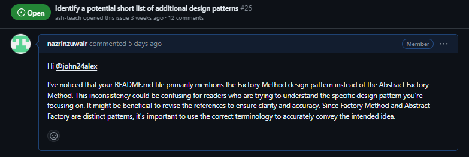
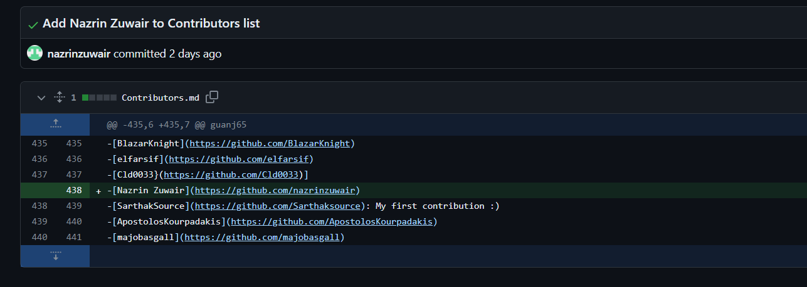

# RESEARCH AND REFLECTION JOURNAL

## Weekly Activities and Key Insights

- [Week 8](#week-8)
- [Week 9](#week-9)
- [Week 10](#week-10)
- [Week 11](#week-11)
- [Week 12](#week-12)
- [Contributions](#contributions-overview)

## Week 8  - Research and Reflection Journal 

### RESEARCH A NEW LANGUAGE

Lua is an embeddable scripting language and is popular for its powerful and lightweight features. Lua has been used in many industrial applications, such as Adobe's Photoshop Lightroom, and in embedded systems like the Ginga middleware for digital TV in Brazil (Lua, 2024). Additionally, Lua is prominently featured in many famous games, such as World of Warcraft and Angry Birds. Lua also facilitates rapid modifications to basic systems, existing applications, or hardware (Stieg, 2022). Furthermore, Lua is increasingly used in network programming, such as in CISCO Systems, Nmap, and ModSecurity, to enhance overall performance and create advanced functionalities. It plays a major role in scripting tasks, including automation, file manipulation, and web scraping, often combined with other languages to  craft tailored applications  (Wambua, 2022).

There are many valuable online resources available for learning Lua. Some of my favorite websites include:

  - [Lua.org](https://www.lua.org/home.html) - Lua's official website, providing comprehensive documentation and resources.
  - [Tutorialspoint](https://www.tutorialspoint.com/lua/index.htm) - Tutorialspoint offers a detailed Lua tutorial covering various aspects of the language.
  - [Lua Learning](https://www.lualearning.org/) - Lua Learning organization provides interactive tutorials and resources for beginners and advanced learners alike.
  - [Codecademy](https://www.codecademy.com/learn/learn-lua) - Codecademy offers an interactive Lua course for learning through hands-on exercises and projects.

### REFLECT ON SLACK NEW LANGUAGE RESPONSES

I've had the opportunity to delve into the responses shared by fellow students this week, and it's been enlightening. While exploring Lua, I stumbled upon valuable insights shared by my peers, which deepened my understanding of the language. Moreover, I gained a comprehensive overview of other languages like Haskell and Processing through their posts. This process not only expanded my knowledge but also helped me identify additional resources beyond what I initially discovered. It's been a rewarding experience, and I look forward to further exploration.

### WRITE A USER STORY    

The app that I have chosen is Facebook because of its popularity among diverse user groups and its wide range of uses.

   - User Stories:

       1. As a student, I use Facebook to join local groups to find vacant rooms in the valley.
       2. As a job seeker, I use Facebook to join local communities to learn about those who are actively hiring.
       3. As a businessman, I use Facebook to join Marketplace groups for buy/sell purposes.
       4. As a student, I use Facebook to look for information on visa processing, Asian restaurants, etc.
       5. As a local, I use Facebook to get updates on upcoming events, job fairs.

   - Acceptance Criteria:

       1. Include a hashtag feature to indicate relevant locations, preferences, and event names.
       2. Implement upload features to allow users to upload images.
       3. Provide text fields for users to input and post content.
       4. Include a search field for users to easily find relevant information.
       5. Example of Acceptance Criteria:

   - Hashtagged posts should be searchable and clickable, leading to related content.
       1. Uploaded images should display correctly and be scalable for various screen sizes.
       2. Text fields should support a variety of characters and allow for basic formatting options.
       3. The search field should provide relevant results based on keywords and hashtags.

### READ THE RESEARCH & REFLECTION ASSIGNMENT
Today, I spent time carefully reading the Research & Reflection Assignment. I learned what's expected and how my work will be judged from the assignment description and rubric. Understanding this helps me start the assignment in a structured and effective way.

### CHOOSE A LANGUAGE FOR COMMUNITY CODE
The language I would like to focus on for the community code project is JavaScript. I have years of experience using JavaScript, starting almost since my Higher National Diploma. Although my proficiency is at a basic level rather than advanced, I aim to utilize this opportunity to conduct thorough research on the language, improve my skills, and gain hands-on experience. One major reason why I chose JavaScript is because I believe that making weekly progress on the community project using this language will help me stay on track and learn about its complexity without giving up.

### STAR GITHUB TOPICS AND REPOSITORIES OF INTEREST
While exploring my GitHub explorer tab, I noticed some repositories that caught my interest, such as ['tipjs/javascript-style-guide'](https://github.com/tipjs/javascript-style-guide) and ['ryanmcdermott/clean-code-javascript'](https://github.com/ryanmcdermott/clean-code-javascript). Then, I explored the Topics tab and found more intriguing repositories like ['freeCodeCamp/freeCodeCamp'](https://github.com/freeCodeCamp/freeCodeCamp) and ['Asabeneh/30-Days-Of-JavaScript'](https://github.com/Asabeneh/30-Days-Of-JavaScript), which I believe will help me achieve my goal of mastering JavaScript skills. Next, while browsing the trending section, I came across the repository ['LeCoupa/awesome-cheatsheets'](https://github.com/LeCoupa/awesome-cheatsheets), which offers useful JavaScript snippets for effective animation. After that, I checked the Collections tab and found the ['Front-end JavaScript frameworks'](https://github.com/collections/front-end-javascript-frameworks) collection, which aligns perfectly with my language preferences. Doing this helped me to fill my Explorer tab with some really interesting and valuable repositories.

### FOLLOW-UP QUESTIONS AND REFLECTIONS

1. What is one interesting thing that you’ve learned from researching about programming languages and from reading other students’ postings about programming languages in response to the first activity?

    - By researching programming languages, I discovered the differences between them and their unique features. Understanding these differences highlighted how choosing the appropriate language can significantly enhance the functionality of an application. Additionally, reading my classmates' postings about their chosen languages provided insight into how each individual perceives the importance of their selected language and how they base their choices on their skills and interests.

2. What other programming languages might you consider to work with for DGL 104? What are your second choices, and why?

    - While considering other programming languages for DGL 104, I was intrigued by the idea of working with newer languages like React Native or Kotlin. My second choice would have been React Native, as it offers cross-platform development capabilities. However, I decided against choosing these languages due to their novelty and the limited time available for in-depth research. Given the constraints of the project timeline, I opted to focus on a language with which I already had some familiarity to maximize productivity and learning outcomes.

3. What did you find most interesting when examining repositories on GitHub? Is there anything that surprised you, or that you didn’t expect? What similarities are there across some of the repositories you’ve starred?

    - Examining repositories on GitHub proved to be incredibly valuable. I was particularly fascinated by the diverse techniques and programming styles employed by different contributors. It was surprising to see how contributors collaboratively work on a single repository, demonstrating the value of teamwork in producing high-quality outputs. Moreover, I observed similarities across some of the repositories, such as the use of modular code structures, comprehensive documentation, and active community engagement. 

## REFERENCES
Academy, C. (n.d.). Learn Lua. Retrieved from Codecademy: https://www.codecademy.com/learn/learn-lua

Learning, L. (n.d.). Tutorials. Retrieved from Lua Learning: https://www.lualearning.org/

Lua. (2024, March 1). About. Retrieved from Lua: https://www.lua.org/about.html#:~:text=What%20is%20Lua%3F,driven%20programming%2C%20and%20data%20description.

Lua. (n.d.). Lua. Retrieved from Lua: https://www.lua.org/home.html

Stieg, C. (2022, November 16# FOLLOW-UP QUESTIONS AND REFLECTIONS    ). Why Lua Is So Popular — & What You Can Build With It. Retrieved from Code Academy: https://www.codecademy.com/resources/blog/what-is-lua-programming-language-used-for/

Tutorials Point. (n.d.). Lua Tutorial. Retrieved from Tutorials Point: https://www.tutorialspoint.com/lua/index.htm

Wambua, D. W. (2022, February 4). Who Uses Lua? Companies That Use Lua and What Lua Is Used For. Retrieved from Career Karma: https://careerkarma.com/blog/who-uses-lua/

## Week 9  - Research and Reflection Journal

### READ THE COMMUNITY CODE ASSIGNMENT

In reading the information about the community code project, I found that we should focus on contributing to an open-source project and writing code. I really like how the assignment is structured because it's only about writing code for one of them. Additionally, I understand the different coding contributions that I have to make, such as using a programming language and another using a markup language.

For Part 1 of the assignment, the focus is on contributing to a real open-source community. I feel that, for this purpose, I would be more willing to use approaches like improving code documentation, writing a code tutorial, or working on translations. These would be the best choices for me to contribute. The major reason for choosing these instead of writing code or answering community questions is because I am still at a basic level, and I will not be able to do my best with the limited time available for those tasks.

For Part 2, I understand that I have to make my contributions to the DGL 104 pattern library repository. I will be applying my coding skills to this section with a focus on design patterns. After looking at the rubrics, I feel they are pretty clear, and a good grade can be achieved by following them. I also appreciate the structured categorization in the rubrics, which helps to focus on achieving the highest grade.

### READ THE RESEARCH AND REFLECTION GUIDE

I read the 'Research and Reflection Journal Guide', which was very helpful for me in understanding the lecturer's expectations. Initially, I completed my work using a different structure. However, after reading the 'Research and Reflection Journal Guide', I found a much better method to structure my journal. It also helped me identify the tense of language that I should use when writing it.

### READ “HOW TO CONTRIBUTE TO OPEN SOURCE”

#### Summary

By reading the [How to Contribute to Open Source](https://opensource.guide/) guide, I gained an understanding of the underlying reasons why people contribute to open source and how contributing serves as a means to learn and develop hands-on experience. The guide also provided insights into becoming an open-source contributor, the types of individuals involved in an open-source project, and the various types of documentation (e.g., license, README, contributing, etc.) associated with a repository. Furthermore, it offers detailed explanations about the tools utilized in an open-source project to organize discussions. Additionally, the guide shed light on different effective ways to find a project to contribute to, offering a useful pre-made checklist to assess whether a project is suitable for accepting contributions. It also outlines various methods to submit contributions, including communication practices, performing a quick check on the README file, identifying appropriate situations to open an issue, the accurate way to open a pull request, and the post-submission process.

Exploring the "What it means to contribute" section, I learned that contributing to open source isn't solely about coding, contrary to what I believed over the past year. I was able to identify highly effective ways to contribute to the code, such as:

1. Organizing the project’s conference
2. Restructuring layouts to enhance the project’s usability
3. Writing and improving the project’s documentation (which I personally enjoy doing)
4. Translating the project’s documentation
5. Linking to duplicate issues and suggesting new issue labels, among other methods.

Moreover, the "Finding a project to contribute to" section helped me understand how to leverage the repositories I typically use or find anything interesting. It also emphasized the significance of small contributions, such as correcting a typo or updating areas for improvement. Additionally, it introduced valuable resources like [GitHub Explore](https://github.com/explore/), [Open Source Friday](https://opensourcefriday.com/), and [First Timers Only](https://www.firsttimersonly.com/) for discovering projects that are best for contribution.

#### Reflection

Upon reading the "How to Contribute to Open Source" guide, I gained a clear understanding of the appropriate approach needed to engage with community code projects. Utilizing its insights, my initial plan involves using the checklist to identify a repository that aligns with my level of knowledge and expertise. Subsequently, I aim to employ various strategies such as drafting project documentation, providing translations, creating tutorials, and addressing issues such as duplicates and typos for contributing to the community.

### FIND POTENTIAL PROJECTS TO CONTRIBUTE TO

- Task 1

    I visited three websites, Good First Issue, Up for Grabs, and CodeTriage, and conducted searches specifically for projects based on JavaScript. Utilizing filtering options such as language and labels such as documentation, good first issue, and help wanted proved instrumental in identifying the most suitable projects to focus on for this assignment. As a result of these searches, I discovered numerous projects aligned with my interests and areas where I aim to contribute.

- Task 2

    Below is the list of three projects/repositories that I am interested in contributing to:

    01. One repository that has captured my attention the most is [First Contributions](https://github.com/firstcontributions/first-contributions/). It is specifically designed to assist beginners in making their first contributions to open-source projects.  This repository is highly active, boasting over 5000 contributors and offering many language translations. Currently, there are about 16 active issues and 465 pull requests.

        

    02. Another project that has piqued my interest is [Activist](https://github.com/activist-org/). This repository is dedicated to learning proven and innovative strategies for social and ecological change from one another. It is a valuable resource for those passionate about making a difference.

        Activist is not only a good repository but also a very active one, boasting a community of 93 contributors. Currently, there are 8 pull requests awaiting review. This project encompasses various aspects such as coding, design, and offers support for multiple programming languages including JavaScript, Python, Django, TypeScript, and more.

        

    03. The third project that catches my attention is [Teammates](https://github.com/TEAMMATES/teammates/), a valuable resource for managing peer evaluations and other feedback channels for students. This repository hosts the Teammates website, a free online tool designed for this purpose.

        Teammates is not only an impressive resource but also an active one, boasting a community of 639 contributors. Currently, it has 91 open issues and 28 pull requests awaiting review. With its active community and focus on enhancing student feedback mechanisms, I believe it's an excellent platform for contributing my skills.

        

### EXPLORE COMMUNITY CONNECTIONS

First, I delved into the community connections of [Teammates](https://github.com/TEAMMATES/teammates/) and discovered that they do not utilize messaging platforms or other typical environments for community engagement. Instead, they encourage users to post messages directly into their [issue tracker](https://github.com/TEAMMATES/teammates/issues/new).

Next, I explored [Activist](https://github.com/activist-org/) and found that they offer a dedicated Community space for individuals involved with and utilizing activist.org. This space comprises four distinct rooms and areas:

1. **LocalizationSuggested**: Discussion area focusing on activist's copy and its localization, accessible at https://crowdin.com/project/activist.
   
2. **GeneralSuggested**: The primary room for the activist.org community to engage in diverse discussions, share ideas, and exchange news.
   
3. **DevelopmentSuggested**: Platform for discussions centered around the development of activist, located at https://github.com/activist-org/activist.
   
4. **Inspiration**: Repository of links to resources that could serve as inspiration for the design or development of activist.

Lastly, I investigated [First Contributions](https://github.com/firstcontributions/first-contributions/) and noted that they provide a link to join their Slack team for assistance or inquiries via https://firstcontributors.slack.com/join/shared_invite/zt-29qhyr9lt-Bi7WLbgGIFqV7aCEG_grvg#/shared-invite/error. However, it seems that the provided link is currently inaccessible or broken.

### IDENTIFY ISSUES TO SUPPORT

**First Contributions**

Issue: Add translations for cli-tool-tutorials.
- URL: [https://github.com/firstcontributions/first-contributions/issues/62077](https://github.com/firstcontributions/first-contributions/issues/62077)
- How I can contribute: I can translate the content into Sinhala, the native language of Sri Lanka, for the cli-tool-tutorials.
  
Discussion: 
- There were discussions among community members, notably about the Urdu and French translations.

**Activist**

Issue: Documentation for JetBrains IDEs
- URL: [https://github.com/activist-org/activist/issues/545](https://github.com/activist-org/activist/issues/545)
- How I can contribute: I can write documentation for setting up JetBrains IDEs, adding information to the readme and contributing guide.

Discussion: 
- Minimal discussions among community members, mainly a query about the presence of VS Code setup suggestions in the guide.
- Two tasks have been completed for this issue since it was opened on November 17th, 2023.

**Teammates**

Issue: Data Migration: Update Developer Docs #12787
- URL: [https://github.com/TEAMMATES/teammates/issues/12787](https://github.com/TEAMMATES/teammates/issues/12787)
- How I can contribute: I can edit the developer documentation to include information about the presence of the SQL database and future plans for twin-db architecture.

Discussion: 
- No discussions among community members as this is a recent issue opened on February 23, 2024.

### WRITE A SUMMARY ON SLACK
I added a summary on slack on 21st of March 2023 for one of the issues I identified in the “Identify Issues to Support” activity as follows:

    "Hey everyone, I wanted to bring your attention to an issue in the First Contributions project on GitHub. The issue is about adding translations for cli-tool-tutorials."

**Issue:** [Add translations for cli-tool-tutorials](https://github.com/firstcontributions/first-contributions/issues/62077)

**Project/Repository:** [First Contributions](https://github.com/firstcontributions/first-contributions) is a beginner-friendly project aimed at helping new developers make their first contribution to open source.

**Contribution Opportunity:** I'm considering contributing by translating the content into Sinhala, the native language of Sri Lanka. This would make the project more accessible to Sinhala-speaking developers and encourage their participation in open source."

### FOLLOW-UP QUESTIONS AND REFLECTIONS

01. What is the most surprising thing that you’ve learned about open source development and/or open source communities during your research this week?

During my research this week, I was surprised to discover various avenues through which I can contribute to open-source projects. Additionally, I gained insights into how open-source communities collaboratively engage in open discussions to address and resolve issues. This research also dispelled a common misconception I had about contributing to open-source projects, as I initially believed it was solely focused on coding. However, I now understand there are other effective ways to contribute.

02. What types of open source projects do you find yourself most drawn to? Is there an obvious connection between them?

I find myself most drawn to web development-related projects, particularly those involving front-end coding and user interface design. This preference aligns with my interests and skills. Moreover, I've noticed a many open repositories based on JavaScript, which further reinforces my attraction to such projects.

03. Is the programming language that you chose last week still the right choice? Should you consider alternatives?

Reflecting on my choice of programming language from last week, I still believe that selecting JavaScript was the right decision. It has provided me with ample opportunities to enhance my knowledge and skills. Therefore, I see no reason to consider alternatives at this time.

## REFERENCES

## Week 10  - Research and Reflection Journal

### COMMUNITY CODE PROCESSES

Today, I spent time watching videos to understand the process of forking repositories, creating branches, finding issues, and opening pull requests for contributing to open-source projects. It helped me properly grasp the idea of creating branches and committing changes to them without impacting the main files. Some of the main tasks I performed while watching are:

1. I watched the **“DGL 104 - Community Code Part 2 - Fork and clone”** tutorial and followed the steps to:

   - Fork the pattern-library repo into my GitHub account
   - Cloned the repository onto my GitHub desktop for further exploration

2. I also watched the **“DGL 104 - Community Code Part 2 - Finding issues”** tutorial and completed the following steps:

   - Checked for ways to identify issues and commit based on different labels, using project backlogs
   - Changed the watch status to "All Activity" to ensure all notification updates on issues are received in my email for keeping me informed and on track

3. Furthermore, I watched the tutorials for **"DGL 104 - Community Code Part 2 - Opening a PR"** and **"DGL 104 - Community Code Part 2 - Closing issues"**. Through these tutorials, I gained a clear understanding of the procedures involved in both opening and closing a pull request

### ASSESS EXTERNAL COMMUNITY CONTRIBUTION GUIDELINES

The [first-contributions](https://github.com/firstcontributions/first-contributions/tree/main) repository encourages beginners to make their first contribution and provides step-by-step instructions for making contributions. They offer guidance on forking, cloning, creating branches, making changes, pushing changes, and submitting them for review, all easily understandable with accompanying images. 

Additionally, they provide a link to set up Git on contributors' local machines, accessible via https://docs.github.com/en/get-started/getting-started-with-git/set-up-git. 

Their [CODE-OF-CONDUCT.md](https://github.com/firstcontributions/first-contributions/blob/main/CODE_OF_CONDUCT.md) serves as a vital document, offering clear guidelines to ensure a supportive and inclusive atmosphere within the community. It emphasizes values of respect, empathy, and professionalism, encouraging constructive interactions while prohibiting any form of harassment or discrimination. This code underscores the commitment of community members to maintain a safe and welcoming environment for all participants, fostering collaboration and mutual respect.

Thus, the guidelines provided are very easy to understand and follow, making the contribution process accessible to all individuals interested in participating.

### WRITE A SUMMARY ON SLACK

I added a summary on slack on 25th of March 2023 on what you have learned about the community I chosen in terms of contributing as:

    "I've been exploring the [First Contributions](https://github.com/firstcontributions/first-contributions/tree/main) repository for open-source community contributions. The community is dedicated to simplifying and guiding beginners through their first contributions.

    They provide clear, step-by-step instructions with accompanying images for forking the repository, cloning it, creating branches, making changes, pushing them, and submitting for review. Additionally, they offer a link to an external GitHub repository for setting up Git on a local machine, which you can find [here](https://docs.github.com/en/get-started/getting-started-with-git/set-up-git).

    Moreover, the [CODE-OF-CONDUCT.md](https://github.com/firstcontributions/first-contributions/blob/main/CODE_OF_CONDUCT.md) emphasizes values of respect, empathy, and professionalism, while prohibiting harassment or discrimination. They encourage community members to adhere to this code, fostering a safe and welcoming environment for collaboration and mutual respect among all participants."

### CONTRIBUTE TO EXTERNAL COMMUNITY

Please refer to the [CONTRIBUTING.md](https://github.com/nic-dgl104-winter-2024/rrj-nazrinzuwair/blob/main/CONTRIBUTING.md) file for a detailed description of this activity.

### CONTRIBUTE TO PATTERN-LIBRARY

Today, I began my contribution to the Pattern Library repository by forking it into my personal GitHub account, accessible via [pattern-library](https://github.com/nazrinzuwair/pattern-library/tree/main). Then, I reviewed issues that piqued my interest and were aligned with my expertise in JavaScript programming language. Subsequently, I requested to be assigned to these issues by commenting on the respective threads. The issues I focused on are:

1. [Identify a potential short list of additional design patterns #26](https://github.com/nic-dgl104-winter-2024/pattern-library/issues/26)
2. [Research a preferred licensing scheme for this repository #19](https://github.com/nic-dgl104-winter-2024/pattern-library/issues/19)

After careful consideration, I eagerly awaited assignment to these issues to begin my contribution journey.

### FOLLOW-UP QUESTIONS AND REFLECTIONS

01. What is the hardest/most challenging thing you had to do this week for DGL 104? How did you overcome this challenge?

The most challenging task I encountered this week for DGL 104 was allocating time for both Part 1 and Part 2 of the community code project, along with writing reflections in the journal. I followed a method of working on both simultaneously, which led me to fall a bit behind schedule. To overcome this challenge, I adopted a different approach. I prioritized addressing the issues in the pattern-library project and requested assignment to them. I learnt that by focusing on tasks with closer deadlines, I could better manage my time and ensure timely completion of essential project components.

# WEEK 11  - Research and Reflection Journal

### CONNECT WITH YOUR EXTERNAL COMMUNITY

In my endeavor to join First Contributions external community channels, I discovered that they utilize Slack as their primary community channel, with encouragement for all contributors to join. However, upon attempting to access the provided link (https://firstcontributors.slack.com/join/shared_invite/zt-1n4y7xnk0-DnLVTaN6U9xLU79H5Hi62w#/shared-invite/error), it appears to be broken, thus hindering my ability to connect.

### READ THROUGH PATTERN LIBRARY ISSUES

Today, I initiated my contribution to the Pattern Library repository by searching for potential tasks to undertake. After careful consideration, I found two issues that aligned well with my skills and interests:

1. [Add JavaScript implementation of Template pattern #57] (https://github.com/nic-dgl104-winter-2024/pattern-library/issues/57)
2. [Propose a new filename scheme for all pattern files #45] (https://github.com/nic-dgl104-winter-2024/pattern-library/issues/45)

**Issue Assignment**

I promptly requested to be assigned to these issues by commenting on the respective threads. Unfortunately, my request for issue #57 was rejected as the assignees were deemed sufficient for the task. However, I was successfully assigned to work on issue #45.

### CONTINUE CONTRIBUTIONS TO EXTERNAL COMMUNITY

Contribution to [First Contributions](https://github.com/firstcontributions/first-contributions):

   - I began by thoroughly reviewing the [code of conduct](https://github.com/firstcontributions/first-contributions/blob/main/CODE_OF_CONDUCT.md), [License](https://github.com/firstcontributions/first-contributions/blob/main/LICENSE), and [README.md](https://github.com/firstcontributions/first-contributions/blob/main/README.md) to gain an understanding of the repository and the required steps for contributors before engaging in commits.

   - After familiarizing myself with the repository, I explored the list of issues under the issues tab and decided to address [issue 62077](https://github.com/firstcontributions/first-contributions/issues/62077), which entails adding translations for the cli-tool-tutorials.

   - To commence work on the translation, I created a forked version of the repository named [Cli-Tool-Tutorial Sinhala translation](https://github.com/nazrinzuwair/first-contributions/tree/cli-tool-tutorial-sinhala-translation).

   - Subsequently, I embarked on translating the cli-tool-tutorial and sought assistance from [Tharnindu Mudduwe Jayasekara](https://github.com/tharinduj31), the only individual in the class proficient in Sinhala, to perform a review of the translation.

### CONTRIBUTE TO PATTERN-LIBRARY
The list of actions I took in related to pattern-library are:

1. License Selection: Evaluating Options for Repository

   - I began by working on [issue 19](https://github.com/nic-dgl104-winter-2024/pattern-library/issues/19).

   - Firstly, I examined Dhuds1's comment to understand her choice of license and conducted research to learn about its pros and cons, as it was not listed among her choices. Then, I visited multiple websites to identify the best license, considering the purpose of this repository. Among the browsed websites, I found https://choosealicense.com/ to be very useful and reliable for choosing the appropriate license.

   - I discovered that the MIT License (https://choosealicense.com/licenses/mit/) and GNU General Public License (GPL) version 3 (https://choosealicense.com/licenses/gpl-3.0/) are the best choices of license. I left a comment in the repository [issue 19](https://github.com/nic-dgl104-winter-2024/pattern-library/issues/19#issuecomment-2014618539) and requested that the issue be assigned to me, addressing Ashley.

2. Code Review: Ensuring Consistency and Accuracy in the Abstract Factory Design Patterns Repository   

   - Next, I performed a code review on john24alex's [Abstract Factory and design patterns folder structure](https://github.com/nic-dgl104-winter-2024/pattern-library/pull/50). Initially, I thoroughly read the information provided in his README.md file within his  [Abstract-factory repository](https://github.com/john24alex/pattern-library/tree/main/patterns/abstract-factory).

   - I noticed that his README.md file primarily mentions the Factory Method design pattern instead of the Abstract Factory Method, despite working on the latter. I commented on his repository, requesting him to make amendments to it [here](https://github.com/nic-dgl104-winter-2024/pattern-library/issues/26#issuecomment-2016903366).

3. Contributions to Design Pattern Library: Factory and Facade Design Patterns Implementation

   - I started to work on [Identify a potential short list of additional design patterns #26](https://github.com/nic-dgl104-winter-2024/pattern-library/issues/26).

   - Firstly, I conducted thorough research on design patterns using JavaScript. I mainly browsed [doFactory](https://www.dofactory.com/javascript/design-patterns), [GeeksforGeeks](https://www.geeksforgeeks.org/javascript-design-patterns/), and [Refactoring Guru](https://refactoring.guru/design-patterns).

   - Then, I selected the Factory design pattern and Facade design pattern to work on.

   - I created the [Factory Design Pattern and Facade Design Pattern #77](https://github.com/nic-dgl104-winter-2024/pattern-library/pull/77):

   - I proceeded by creating separate folders for both the [Factory design pattern](https://github.com/nazrinzuwair/pattern-library/tree/nazrin-zuwair/additional-design-patterns/patterns/Factory-Design-Patten) and [Facade design pattern](https://github.com/nazrinzuwair/pattern-library/tree/nazrin-zuwair/additional-design-patterns/patterns/Facade-Pattern) within the PATTERN-LIBRARY directory. Each folder contained a README.md file and corresponding JavaScript implementation files, namely [factory-method.js](https://github.com/nazrinzuwair/pattern-library/blob/nazrin-zuwair/additional-design-patterns/patterns/Factory-Design-Patten/factory-method.js) for the Factory design pattern and [facade-method.js](https://github.com/nazrinzuwair/pattern-library/blob/nazrin-zuwair/additional-design-patterns/patterns/Facade-Pattern/facade-pattern.js) for the Facade design pattern.
   - Furthermore, I expanded on the READMEs by mentioning alternative programming languages where these design patterns could be applied, along with hyperlinks directing users to relevant resources for further exploration.

# FOLLOW-UP QUESTIONS AND REFLECTIONS  

In my opinion and based on the research I've conducted, JavaScript, which is my chosen programming language, is partially capable of object-oriented programming (OOP). Some individuals argue that it's not purely object-oriented because it lacks support for classes similar to Java. However, others contend that it exhibits object-oriented properties and therefore qualifies as an object-oriented language (Yusuf, 2020). 

Unlike conventional object-oriented languages, JavaScript doesn't have classes; instead, it relies on objects. To be more specific, JavaScript follows a prototype-based object-oriented paradigm, where behaviors are defined using constructor functions and then reused through prototypes (Geeks for Geeks, 2023).

In addition to supporting object-oriented programming, JavaScript also supports various other programming paradigms, such as functional programming, procedural programming, and event-driven programming  (Yusuf, 2020; GarrettMac, 2017; Maria, 2023).

## References

GarrettMac. (2017, September 14). Javascript’s 3 Major Paradigms: Introduction [part 1 of 4]. Retrieved from Medium: https://medium.com/@garrettmac/javascripts-3-major-paradigms-55b5e3b18b8c

Geeks for Geeks. (2023, May 24). Introduction to Object Oriented Programming in JavaScript. Retrieved from Geeks for Geeks: https://www.geeksforgeeks.org/introduction-object-oriented-programming-javascript/

Maria, M. (2023, December 20). Programming Paradigms in JavaScript. Retrieved from https://dev.to/marmariadev/programming-paradigms-in-javascript-oop-functional-and-event-driven-57kn

Yusuf, A.-a. (2020, October 25). Paradigms In JavaScript. Retrieved from Dev: https://dev.to/alamin__yusuf/paradigms-in-javascript-1m31

# WEEK 12 - Research and Reflection Journal

### CONTINUE CONTRIBUTIONS TO EXTERNAL COMMUNITY

1. Refinement of [Cli-Tool-Tutorial Sinhala translation](https://github.com/nazrinzuwair/first-contributions/tree/cli-tool-tutorial-sinhala-translation): Incorporating Feedback

   - I received feedback from the peer review conducted by [Tharnindu Mudduwe Jayasekara](https://github.com/tharinduj31) on the translations. The comments can be accessed via [this link](https://github.com/firstcontributions/first-contributions/pull/82798#discussion_r1538744600).

   - After incorporating the suggested changes, I requested Tharnindu Mudduwe Jayasekara to perform another review on the translation by commenting on the repository [here](https://github.com/firstcontributions/first-contributions/pull/82798#issuecomment-2022050933).

   - Since all feedback on my translation was positive, I added my name to the contributions.md list."

2. Review on Tharindu’s [Amending commit translation - Sinhala #82805](https://github.com/firstcontributions/first-contributions/pull/82805).

   - First, I delved into the English version of the translation, which is accessible [here](https://github.com/tharinduj31/first-contributions/blob/add-tharindu-jayasekara/additional-material/git_workflow_scenarios/amending-a-commit.md). Then, I compared Tharindu's Sinhala translation to assess its clarity and accuracy.

   - I found several grammar and wording errors in the Sinhala translation and suggested improvements to Tharindu through a [comment](https://github.com/firstcontributions/first-contributions/pull/82805#issuecomment-2022033780).

   - After Tharindu made amendments based on my suggestions, I conducted another review on his revised version. Upon inspection, I found it to be satisfactory, so I left a comment in the repository, which can be viewed [here](https://github.com/firstcontributions/first-contributions/pull/82805#issuecomment-2023806820).

### CONTINUE CONTRIBUTIONS TO PATTERN-LIBRARY

1. Instigating Slack Discussion: Soliciting Feedback on Selected Licensing Scheme

   - As [issue 19]((https://github.com/nic-dgl104-winter-2024/pattern-library/issues/19) ) was assigned to me, I then sent a [Slack message](https://digitaldesign-f2i3028.slack.com/archives/C06E2HSCFEY/p1711345646556449) to discuss the licensing scheme I selected for this repository, aiming to gather insights and feedback from others.

2. Code Review: [Add JS Observer Pattern #3 #53](https://github.com/nic-dgl104-winter-2024/pattern-library/pull/53)

   **Initial Review**

   - I conducted a thorough code review of Katrina's implementation of the observer pattern using JavaScript. My focus was primarily on evaluating naming conventions, code clarity, and the inclusion of comments. I recommended the use of descriptive names to clearly convey the purpose of functions and variables. Additionally, I suggested removing unnecessary commented-out code related to switching between different button IDs. Furthermore, I advised Katrina to provide more descriptive comments to enhance understanding. Detailed feedback can be found [here](https://github.com/nic-dgl104-winter-2024/pattern-library/pull/53#issuecomment-2017295394).

   **Review After Revisions**

   - Following Katrina's revisions based on my feedback, I conducted a follow-up review of the Add JS Observer Pattern #3 #53 implementation. Upon review, I found that all suggested changes had been addressed, and the code now meets the required standards. I appreciated Katrina's efforts in incorporating the feedback and ensuring the code's quality, [here](https://github.com/nic-dgl104-winter-2024/pattern-library/pull/53#issuecomment-2018496181).  

3. Refinement of Factory and Facade Design Patterns: Incorporating Feedback

     I worked on the feedback received for [Factory Design Pattern and Facade Design Pattern #77](https://github.com/nic-dgl104-winter-2024/pattern-library/pull/77).

     I received comments from Katrina's code review, which can be accessed [here](https://github.com/nic-dgl104-winter-2024/pattern-library/pull/77#issuecomment-2019496757), and from Ashley, available [here](https://github.com/nic-dgl104-winter-2024/pattern-library/pull/77#issuecomment-2021654691). Based on their feedback, I made the following amendments to my code:

   - Ensured that code references within sentences or paragraphs are denoted using inline code markdown.
   - Initially, I used bold formatting to highlight an important paragraph, but I later removed it to adhere to a more standard styling choice.
   - Replaced an if statement with a switch statement for semantic improvement.
   - Corrected grammatical errors, such as changing "youngers" to "youngsters".
   - Condensed multiple paragraphs discussing each food and its associated benefits into a single paragraph to reduce unnecessary repetition.

4. Code Review: [Dev FP vs OOP #73](https://github.com/nic-dgl104-winter-2024/pattern-library/pull/73)

   I conducted a code review on Sumit Joshi's comparison description of Functional Programming and OOP. The code review can be accessed [here](https://github.com/nic-dgl104-winter-2024/pattern-library/pull/73#issuecomment-2018568998).

    **Feedback Provided:**
   - I suggested adding a couple more sections to the OOP Design Patterns and Functional Patterns as the content appeared to be limited.
   - Additionally, I recommended including a coding example of the Singleton within the overview itself, rather than redirecting to a link.
   - Given the focus on JavaScript programming language, I suggested providing information on how JavaScript is used in OOP Design Patterns and Functional Patterns.
   - I also advised presenting the comparisons within a table-like structure for clarity.

   **Review After Revisions:**
   - After Sumit Joshi made revisions based on the feedback provided, I rechecked the code and descriptions. Everything appeared to be in good order, so I provided another feedback comment, accessible [here](https://github.com/nic-dgl104-winter-2024/pattern-library/pull/73#issuecomment-2018772399).   

5. License Selection Assessment and Feedback Integration

   I assessed the insights and feedback provided by others on the selected license for the project.

   Katrina shared her insights on the license selection in [issue 19](https://github.com/nic-dgl104-winter-2024/pattern-library/issues/19), which can be accessed [here](https://github.com/nic-dgl104-winter-2024/pattern-library/issues/19#issuecomment-2017999110). She proposed the Creative Commons Attribution-NonCommercial-ShareAlike 4.0 International License (CC BY-NC-SA 4.0) along with a list of its pros and cons.

   To reach a conclusion, I conducted the following steps:
   1. Compared the licenses previously mentioned by me (MIT License and GNU General Public License (GPL) version 3) with the license proposed by Katrina (Creative Commons Attribution-NonCommercial-ShareAlike 4.0 International License (CC BY-NC-SA 4.0)) by evaluating their purposes, pros, and cons.
   2. Upon evaluation, I found that having multiple licenses in our GitHub repository would be beneficial. I suggested using both the MIT License and Attribution-NonCommercial-ShareAlike 4.0 International License through a comment, which is accessible [here](https://github.com/nic-dgl104-winter-2024/pattern-library/issues/19#issuecomment-2018477143).

6. Proposal for New Filename Scheme for Pattern Files [issue 45](https://github.com/nic-dgl104-winter-2024/pattern-library/issues/45)

   Before proposing a filename scheme for the pattern files, I first reviewed the comments made by [Kai](https://github.com/nic-dgl104-winter-2024/pattern-library/issues/45#issuecomment-2016937823) and [Katrina](https://github.com/nic-dgl104-winter-2024/pattern-library/issues/45#issuecomment-2017857362).

   Then, I shared my insights through a [comment](https://github.com/nic-dgl104-winter-2024/pattern-library/issues/45#issuecomment-2018426411) with the following points:

   - Suggested opting for more descriptive names for subdirectories and reducing duplicate names for subdirectories.
   - Identified the need to rename the "Observal" directory to "Observer" for consistency.
   - Noted inconsistency in the naming conventions of directories throughout the project and recommended utilizing hyphen-separated naming (kebab-case) for file names to ensure compatibility, readability, and consistency.

## Contributions Overview 

### 1. Community Code Contributions

**Contributions by Myself:**
- [First Contributions - CLI Tool Tutorial Sinhala Translation](https://github.com/nazrinzuwair/first-contributions/tree/cli-tool-tutorial-sinhala-translation)

**Reviews on Others' Contributions:**
- [Review on Amending Commit Translation - Sinhala #82805](https://github.com/firstcontributions/first-contributions/pull/82805) 

### 2. Pattern-Library Contributions

**Contributions by Myself:**
- [Identifying Potential Additional Design Patterns #26](https://github.com/nic-dgl104-winter-2024/pattern-library/issues/26)
- [Proposing a New Filename Scheme for All Pattern Files #45](https://github.com/nic-dgl104-winter-2024/pattern-library/issues/45)
- [Researching a Preferred Licensing Scheme for This Repository #19](https://github.com/nic-dgl104-winter-2024/pattern-library/issues/19)

**Code Reviews:**
- [Review on Abstract Factory and Design Patterns Folder Structure](https://github.com/nic-dgl104-winter-2024/pattern-library/pull/50)
- [Review on Add JS Observer Pattern #3 #53](https://github.com/nic-dgl104-winter-2024/pattern-library/pull/53)

**Documentation Contribution:**
- [Contribution to Dev FP vs OOP #73](https://github.com/nic-dgl104-winter-2024/pattern-library/pull/73)

